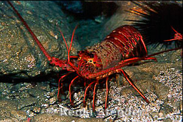
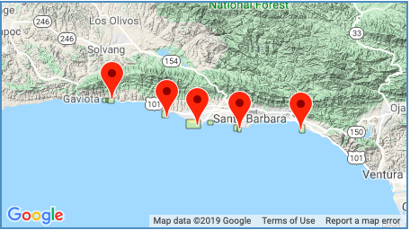

### Introduction

In 2012 Naples and Isla Vista were both recognized as Marine Protected Areas (MPAs). The California Spiny Lobster (*Panulirus interruptus*) 

The MPA designation does not come with required restrictions, but at both 

The MPA's were established in 01/01/2012 and the 2012 samples were taken starting 08/2012, so really just beginning.

 


***Figure 1.*** *Spiny California lobster (left) and study sites along the Santa Barbara Channel (right).Credit: [Marine Life Photography](https://www.marinelifephotography.com/marine/arthropods/lobsters/panulirus-interruptus.htm) and [EDI Data Portal](https://portal.edirepository.org/nis/mapbrowse?scope=knb-lter-sbc&identifier=77&revision=newest)*

### Data and Methods

Data was collected by divers. When counting Califorbia Spiny Losters at each survey site divers were also trained to observe and categorize lobsters by carapace size, measured in millameters (mm).
 

### Results

```{r setup, include=FALSE}
knitr::opts_chunk$set(echo = FALSE)

library(tidyverse)
library(janitor)
library(plotly)
library(DT)
library(kableExtra)

# Read in the data frame. After viewing the data frame, -99999 indicates an NA value, so correct that. 

lobster_abundance <- read_csv("lobster_abundance_sbc_lter.csv", 
                              na = "-99999")

# Next to tidy up the data in other ways. We used this data in lab 5, but the data is a little tidier here. The dat is already in ISO formant and already already classed as a date. For now I'm just going to clean the names and uncount the observations. 

lobster_tidy <- lobster_abundance %>% 
  janitor::clean_names() %>% 
  tidyr::uncount(count) 

```

#### A. Changes in Lobster Abundance by Site

The counts of lobsters observed from 2012 through the most recent available data for 2018. At all sites the count was greater in 2018 than in 2012. The greatest noticeable increase was at the Isla Vista site, where only 26 lobsters were observed in 2012. By 2018 the lobsters were most abundant at the Isla Vista site, with 946 lobsters counted. Divers only observed 6 lobsters in 2012 at the Naples site, the other MPA site designated in 2012. Arroyo Quemado consistently had the lowest counts throughout the observation period. 


```{r}

# I want to plot that to show visually what the abundance at each site looks like over time. 


#I also want to try to rename the different sites with their true name. Added a new column site_name with the unabbreviated name and then wrapped based on that.  


lobster_site <- lobster_tidy %>% 
  group_by(year) %>% 
 mutate(site_name = ifelse(site == "AQUE", "Arroyo Quemado", ifelse(site == "CARP", "Carpinteria", ifelse(site == "IVEE", "Isla Vista", ifelse(site == "MOHK", "Mohawk","Naples")))))
 
# I then wanted to emphasize which locations were in MPAs
#colors_count <- c("Arroyo Quemado" = "gray61", "Carpinteria" = "gray61", "Isla Vista" = "lightseagreen", "Mohawk" = "gray61", "Naples" = "lightseagreen"). That did not work out. 


ggplot(data = lobster_site, aes(x = year)) +
  geom_histogram(binwidth = 1.0) +
  theme_bw() +
  scale_y_continuous(limits = c(0,1000), 
                     breaks = seq(0,1000, by = 100),
                     expand = c(0,0)) + 
  scale_x_continuous(limits = c(2011.5,2018.5), 
                                breaks = seq(2012,2018, 
                                  by = 1), 
                     expand = c(0,0)) +
  labs(title = "Effects of MPAs on Lobster Population", 
       subtitle = "2012-2018",
       x = "Year", 
       y = "Count") +
  theme(panel.grid.minor.x = element_blank(), 
        panel.grid.minor.y = element_blank(),
        axis.text.x = element_text(angle = 270)) + 
  facet_wrap(~site_name, 
             nrow = 2, 
             scales = "free")

```

***Figure 2.*** *California Spiny Lobster populations at the five survey sites. The Isla Vista and Naples sites are both in Marine Protected Areas (MPAs). These sites were designated as MPAs in 2012. Lobsters surveyed at all sites increased from 2012-2018*


#### B. Shifts in Lobster Size Distribution

The observed lobster size distribution at Carpinteria and Mohawk remained relatively stable. At Arroyo Quemado and Naples the size shifted to have a larger mean in 2018 than 2012. At the Isla Vista site the observed size became dramatically larger over the same time period. See *Figure 4* for comparison of the mean lobster size and distribution at MPA and non-MPA sites.


```{r}
# Next we want to tract the lobster size distribution and compare the size distribution in 2012 vs 2018. To do this we want to filter observations for only the years 2012 and 2018. 

lobster_size <- lobster_tidy %>% 
  filter(year == 2012 | year == 2018)%>% 
 mutate(site_name = ifelse(site == "AQUE", "Arroyo Quemado", ifelse(site == "CARP", "Carpinteria", ifelse(site == "IVEE", "Isla Vista", ifelse(site == "MOHK", "Mohawk","Naples"))))) %>% 
  mutate(year = as.character(year))


ggplot(data = lobster_size, aes(x = size_mm, group = year, color = year)) +
  geom_density() +
  theme_bw() +
  labs(title = "Lobster Size", subtitle = "2012 vs. 2018", x = "Length (mm)", y = "Density") +
  theme(panel.grid.minor.x = element_blank(), 
        panel.grid.minor.y = element_blank(), 
        legend.title = element_blank()) +
  facet_wrap(~site_name)
```

***Figure 3.*** *The distribution of lobster carapace length collected by visual survey. All sites exhibit normal distribution.*


#### C. Mean lobster size at MPA vs. non-MPA sites in 2012 and 2018

All site samples followed a normal distribution for bother 2012 and 2018 as shown *Figure 3*. A quantile-quantile plot for each year and for both MPA and non-MPA sites was also produced and exhibited a linear relationship confirming normal distributions. Additionally, each year had a large enough sample size to conduct statistical analysis to infer more about the California Spiny Lobster populations at these sites. 


```{r}
#First I want to get my data into a useable shape and make a distinction between MPA and non-MPA in the dataframe. I think I also want to filter for the year 2012 and 2018 now even though I'll have to filter it down more later.  

lobster_mpa_nmpa_2012_2018 <- lobster_tidy %>% 
  mutate(mpa = ifelse(site == "IVEE" | site == "NAPL", "MPA", "non-MPA")) %>% 
  filter(year == "2012"| year == "2018")

```

###### 1. Mean lobster size comparison in 2012 between MPA and non-MPA areas. 

- H~0~: There is *no* significant difference in mean lobster size in 2012 between MPA and non-MPA sites. 
- H~A~: There *is* a significant difference in mean lobster size in 2012 between MPA and non-MPA sites.

$\alpha$ = 0.05

```{r, include = FALSE}

# Since I'm only comparing 2012 data I want to seperate that out first. It should be noted that I'm on the low side of observations for MPA. I have 32 obsevations and usually the CLT requires 30.  

lobster_2012_mpa <- lobster_mpa_nmpa_2012_2018 %>% 
  filter(year == "2012") %>% 
  filter(mpa == "MPA")

lobster_2012_nmpa <- lobster_mpa_nmpa_2012_2018 %>% 
  filter(year == "2012") %>% 
  filter(mpa == "non-MPA")

# Ok, I should explore these. I alreay have the histograms above, but I should look at the QQ plot too

ggplot(data = lobster_2012_mpa, aes(sample = size_mm)) +
  geom_qq()

ggplot(data = lobster_2012_nmpa, aes(sample = size_mm)) +
  geom_qq()

# They looked normally distributed above and the qq plots look pretty linear. I guess we also did this in lab. 

# Ok, now I want to do some testing to see if I reject my null hypothesis or not. 

lobster_2012_test <- t.test(lobster_2012_mpa$size_mm, lobster_2012_nmpa$size_mm)


```
Mean 2012 lobster size (mm) measured at Marine Protected Areas (`r round(lobster_2012_test$estimate[1], 2)`) and non-Marine Protected Areas (`r round(lobster_2012_test$estimate[2], 2)`) differ significantly (t(`r round(lobster_2012_test$parameter, 2)`) = `r round(lobster_2012_test$statistic,2)` *p* = `r round(lobster_2012_test$p.value,3)`).

In 2012 lobsters at non-MPA sites were significantly larger than those at recently established MPA sites. 

##### 2. For 2018 observations, is there a significant difference in lobster size between MPA and non-MPA sites? 

- H~0~: There is no significant difference in mean lobster size in 2018 between MPA and non-MPA sites. 
- H~A~: There is a significant difference in mean lobster size in 2018 between MPA and non-MPA sites. 

$\alpha$ = 0.05


```{r, include = FALSE}
# Ok, now that I've looked at 2012 data, now I want to compare the data for MPA and NMPA for 2018. This is after the MPA has been in place 6 years. 

lobster_2018_mpa <- lobster_mpa_nmpa_2012_2018 %>% 
  filter(year == "2018") %>% 
  filter(mpa == "MPA")

lobster_2018_nmpa <- lobster_mpa_nmpa_2012_2018 %>% 
  filter(year == "2018") %>% 
  filter(mpa == "non-MPA")

# I should look at the QQ plots for these guys too. 
ggplot(data = lobster_2018_mpa, aes(sample = size_mm)) +
  geom_qq()

ggplot(data = lobster_2018_nmpa, aes(sample = size_mm)) +
  geom_qq()

# They look linear as well. 

# Ok, now I want to do some testing to see if I reject my null hypothesis or not. 

lobster_2018_test <- t.test(lobster_2018_mpa$size_mm, lobster_2018_nmpa$size_mm)

```


Mean 2018 lobster size (mm) measured at Marine Protected Areas (`r round(lobster_2018_test$estimate[1], 2)`) and non-Marine Protected Areas (`r round(lobster_2018_test$estimate[2], 2)`) differ significantly (t(`r round(lobster_2018_test$parameter, 2)`) = `r round(lobster_2018_test$statistic,2)` *p* < 0.001).

By 2018, after the MPAs had been established for 8 seasons, lobsters at MPA sites were significantly larger than those at non-MPA sites. The spread in means was much smaller in 2018 than in 2012. 


##### 3. For MPA sites only, is there a significant mean size difference in lobsters observed in 2012 vs. 2018?

- H~0~: There is no significant difference in mean lobster size between 2012 and 2018 at MPA sites. 
- H~A~: There is a significant difference in mean lobster size between 2012 and 2018 at MPA sites.

$\alpha$ = 0.05


```{r}
# I think that we already have the correct data frames for these, and we've already confirmed via the QQ plot that they have a linear relationship with another normally distributed dataframe. I think we should be good to go to do a t.test

lobster_mpa_2012_2018_test <- t.test(lobster_2012_mpa$size_mm, lobster_2018_mpa$size_mm)

```


The mean lobster size (mm) at MPA sites measured in 2012 (`r round(lobster_mpa_2012_2018_test$estimate[1], 2)`) and 2018 (`r round(lobster_mpa_2012_2018_test$estimate[2], 2)`) differs significantly (t(`r round(lobster_mpa_2012_2018_test$parameter, 2)`) = `r round(lobster_mpa_2012_2018_test$statistic, 2)` *p* < 0.001).


##### 4. For non-MPA sites only, is there a significant mean size difference in lobsters observed in 2012 vs. 2018?

- H~0~: There is no significant difference in mean lobster size between 2012 and 2018 at non-MPA sites.
- H~A~: There is a significant difference in mean lobster size between 2012 and 2018 at non-MPA sites.

$\alpha$ = 0.05


```{r}
# And we already have the the dataframes to compare non MPA sites, so we can do another t.test. 

lobster_nmpa_2012_2018_test <- t.test(lobster_2012_nmpa$size_mm, lobster_2018_nmpa$size_mm)
```

The mean lobster size at non-MPA sites measured in 2012 (`r round(lobster_nmpa_2012_2018_test$estimate[1], 2)`) and 2018 (`r round(lobster_nmpa_2012_2018_test$estimate[2], 2)`) does not differ significantly (t(`r round(lobster_nmpa_2012_2018_test$parameter, 2)`) = `r round(lobster_nmpa_2012_2018_test$statistic, 2)` *p* = `r round(lobster_nmpa_2012_2018_test$p.value, 3)`).

***Figure 4.*** *Comparison of mean lobster size (mm) in 2012 and 2018 at MPA and non-MPA sites. The mean carapace size increased by 10 mm at MPA sites between 2012, when they were first established and 2018. Non-MPA sites did not exhibit the same large increase over that time.*
```{r}
# I have to create a summary table with the mean size_mm and standard deviation size and the sample size in 2012 and 2018 for the two groups: MPA and non-MPA

lobster_summary <- lobster_mpa_nmpa_2012_2018 %>% 
  group_by(year, mpa) %>% 
  summarize(
    mean_size = mean(size_mm, na.rm = TRUE),
    sd_size = sd(size_mm, na.rm = TRUE),
    sample_n = n()
  )

lobster_summary %>% 
  kable(col.names = c("Year",
                      "Marine protected area", 
                      "Mean size (mm)",
                      "Standard deviation size (mm)", 
                      "Sample size (n)")) %>% 
  kable_styling(bootstrap_options = "striped", 
                full_width = F, 
                position = "left") %>% 
  add_header_above(c("Lobster Metrics" = 5))


```

### Summary


### References 

Reed D. 2019. SBC LTER: Reef: Abundance, size and fishing effort for California Spiny Lobster (Panulirus interruptus), ongoing since 2012. Environmental Data Initiative. https://doi.org/10.6073/pasta/a593a675d644fdefb736750b291579a0. Dataset accessed 10/30/2019.